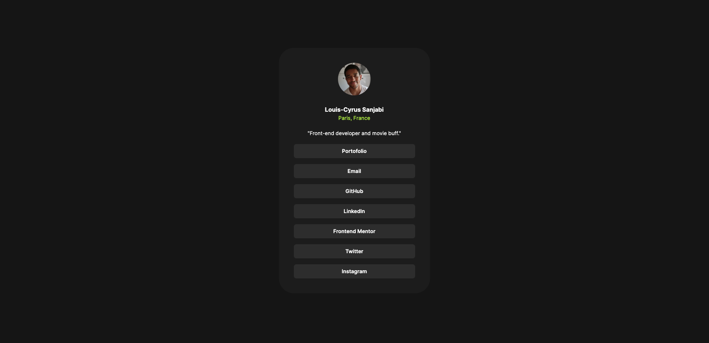
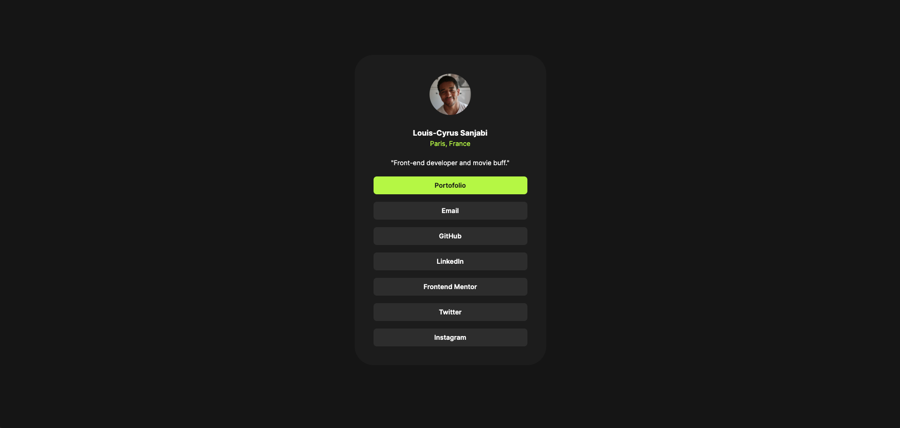
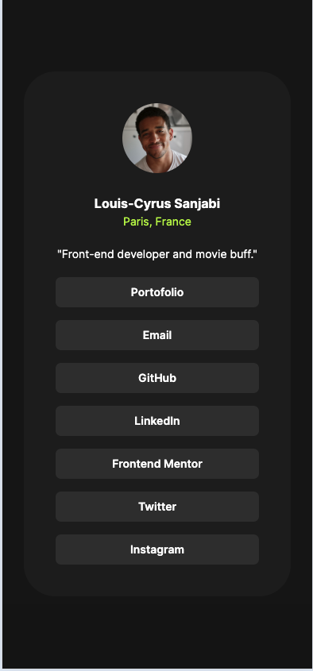

# Frontend Mentor - Social links profile solution

This is a solution to the [Social links profile challenge on Frontend Mentor](https://www.frontendmentor.io/challenges/social-links-profile-UG32l9m6dQ). Frontend Mentor challenges help you improve your coding skills by building realistic projects.

## Table of contents

- [Overview](#overview)
  - [The challenge](#the-challenge)
  - [Screenshot](#screenshot)
  - [Links](#links)
- [My process](#my-process)
  - [Built with](#built-with)
  - [What I learned](#what-i-learned)
  - [Continued development](#continued-development)
  - [Useful resources](#useful-resources)
- [Author](#author)

## Overview

### The challenge

Users should be able to:

- See hover and focus states for all interactive elements on the page

### Screenshot

### Links

- Solution URL: [Add solution URL here](https://your-solution-url.com)
- Live Site URL: [Add live site URL here](https://your-live-site-url.com)

## My process

### Built with

- Semantic HTML5 markup
- CSS custom properties
- Flexbox
- Mobile-first workflow

### What I learned

I consolide my knowledge about HTML and CSS.

### Continued development

For the future projects, I will try to use Tailwind CSS instead of classic CSS.

### Useful resources

- [MDN Web Docs](https://developer.mozilla.org/fr/) - This helped me for the HTML and CSS tags.

## Author

- Website - [Louis-Cyrus Sanjabi](https://portfolio-louiscyrus.vercel.app/)
- Frontend Mentor - [@Louis-Cyrus](https://www.frontendmentor.io/profile/Louis-Cyrus)
- Twitter - [@SanjabiCyrus](https://twitter.com/SanjabiCyrus)
